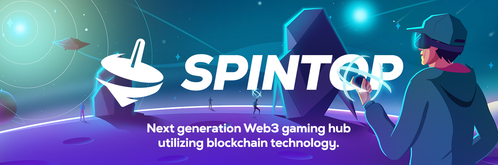

# Spintop Intro

<figure><figcaption></figcaption></figure>

### Vision



As of 2022, the global gaming market has reached 194 billion USD, with over 2.8 billion players worldwide. This booming sector has become intertwined with our daily lives; most of us compete, spending our free time in this modern virtual realm made possible by the internet revolution. Yet, another iteration of this revolution has been brought about by blockchain technology, which allows  us to truly own our digital expenditures as transferable assets.&#x20;

### What is Spintop?

Spintop is a social Web3 gaming ecosystem, which enables users to form self-governing communities, own, manage, and utilize Web3 gaming assets collectively, and seamlessly keep track of their activities via gamified identities.&#x20;

_Spintop ecosystem consists of five main tools acting together:_

* **Automated Decentralized Guild Protocol (ADGP):** Pool and share your utility NFTs - Gamified & Social Treasury and Governance Tool powered by multiple web3 technologies:
  * DAO Vault Governance Protocol
  * NFT Wrapper
  * Wallet Abstraction: SpinWallet
  * Soulbound NFT factory
* **Profiles & Quests:** Spintop User Profiles working seamlessly accross the ecosystem, tracked on-chain with soulbound NFTs.  A decentralized exchange (Dex) where gaming tokens are pooled together to create liquidity, incentivizing yield farming. \
  Incentivize user engagement with gamified quest and leveling system based on game performance and contributions to the ecosystem.
* **Gamepedia:** Comprehensive discovery and guidance tool positioned as the traffic provider to the ecosystem. Users can:
  * Discover web3 games
  * Get informed by peer reviews&#x20;
  * Learn via game guides
  * Become proficient in web3 with Academy
* **NFT Marketplace & Exchange:** The supply and trade ground for gamers integrated into ADGP.\
  Individual users and DAOs can purchase or rent gaming NFTs to complement their NFT inventory or generate income by lending or selling their assets on the marketplace.
* **Launchpad:** Introducing in-game assets (Tokens &  NFTs) to the Web3 gaming ecosystem as a tierless and permissionless launchpad. Getting games integrated into the ecosystem during the public investment  round and/or game development phase.

