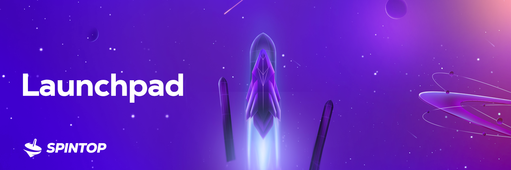

# 🚀 Launchpad

<figure><figcaption></figcaption></figure>

### Tierless System: A fresh and fair approach

In a world where blockchain launchpads have tiered systems that create high barriers of entry for the majority of people, we bring a fresh egalitarian approach to remove these hurdles. SpinStarter works as a complete tierless and permissionless system, so by design we lower the barriers of entry for everyone to provide equal pool weight for all contributors.&#x20;

#### Min and Max contribution:

To keep the allocations fair for the users. Spintop will limit contributions per user to the Spinstarter Vault, a minimum and maximum boundary as follows:

_Min: 15,000 $SPIN_

_Max: 5,000,000 $SPIN_

### Incubator Platform: Continuous post-IGO support

We are building Spintop as the go to one-stop-shop for blockchain gaming. With that in mind, we will be providing our IGO partners with full support after the IGO process on Spinstarter to help with their token utility, via Spindex DeFi opportunities, Gamepedia listing, Guildmaker and Marketplace priority access. Our partners will have direct access to a growing and engaged community of gamers and investors.
